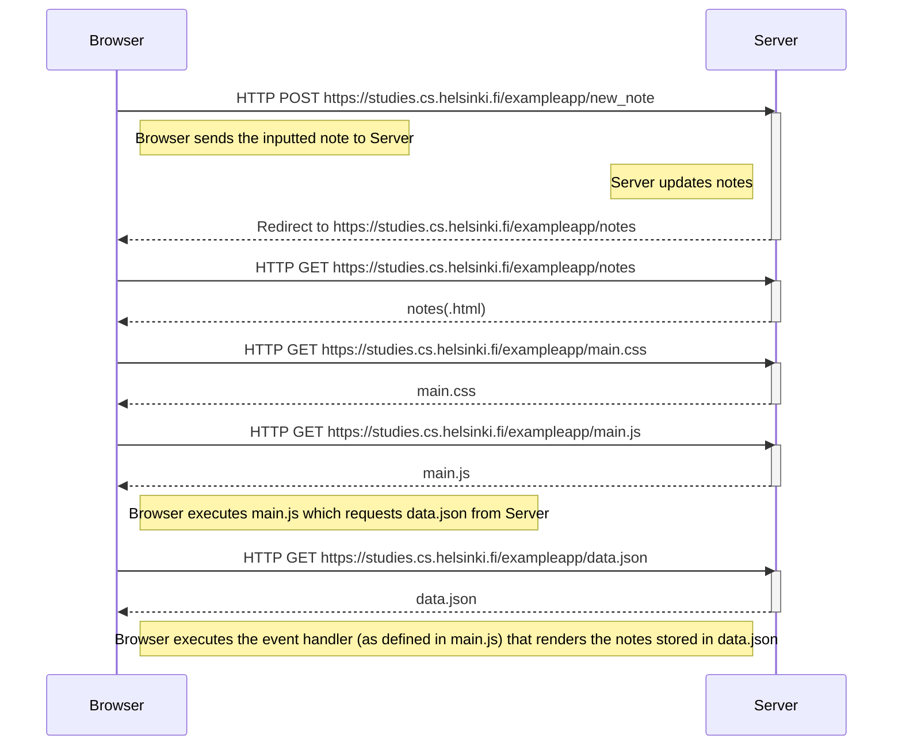
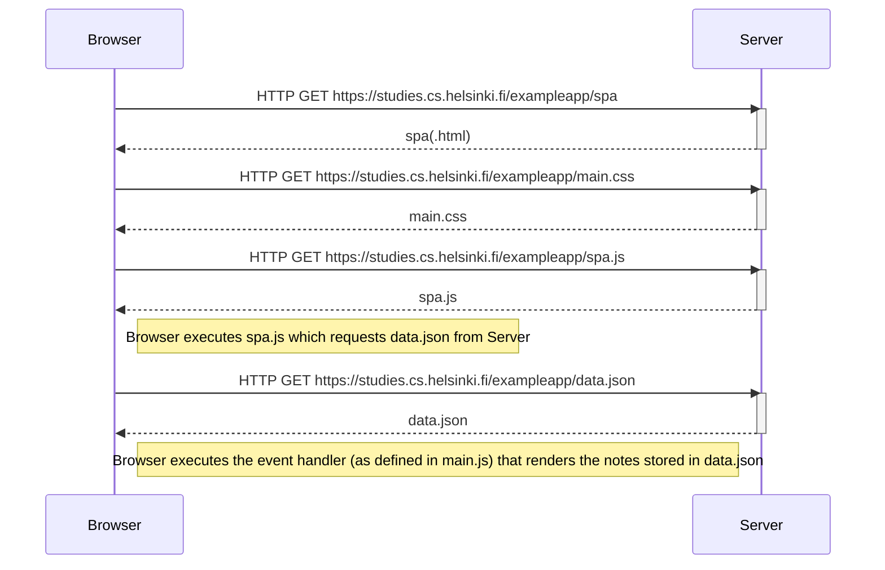
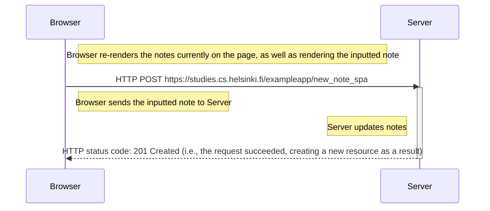

https://fullstackopen.com/en/part0/fundamentals_of_web_apps#exercises-0-1-0-6
<h1>0.4: New note diagram</h1>

<h1>0.5: Single page app diagram</h1>

<h1>0.6: New note in Single page app diagram</h1>

